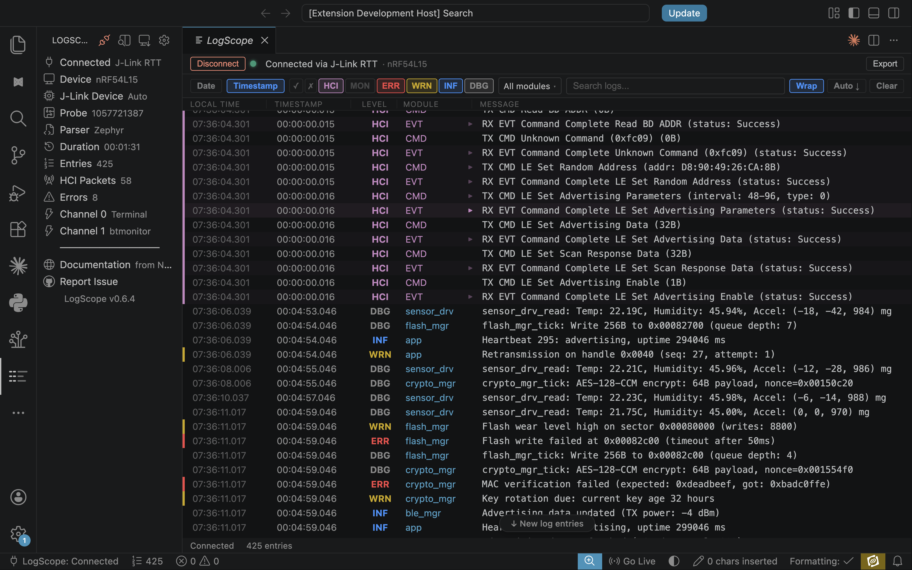

# LogScope

**Live RTT log viewer for VS Code with Bluetooth LE HCI decoding inline, direct-memory recovery, fault auto-detect, and Wireshark btsnoop export. Built by Novel Bits, the team behind the Bluetooth Developer Academy.**

LogScope streams logs directly from your embedded device via J-Link RTT or Serial UART. View Zephyr RTOS, nRF5 SDK, or any firmware logs in a modern, filterable viewer with deep Bluetooth LE protocol decoding built in.

Works great alongside **nRF Connect for VS Code** as a dedicated log analysis companion.

## Why LogScope?

When your debugging sessions get longer and your log output gets denser, LogScope gives you the tools to make sense of it all:

- **Filter by severity and module** to focus on what matters
- **Search across thousands of log lines** with regex
- **Decode Bluetooth LE HCI packets** inline, not in a separate tool
- **Detect crashes and faults automatically** with auto-pause
- **Export to structured formats** (JSON Lines, Wireshark btsnoop) for sharing and analysis
- **Switch between probes** without disconnecting
- **Auto-reconnect after flashing** so you never lose your session

## Features

### Log Parsing
- **Multi-parser support** — choose between Zephyr, nRF5 SDK, and Raw mode to match your firmware
- **Zephyr log parsing** — color-coded severity levels, module names, and timestamps parsed automatically
- **nRF5 SDK parsing** — parses `<info> module: message` format with severity mapping and optional tick timestamps
- **Raw mode** — display lines as-is for bare printf, ESP-IDF, or any firmware output
- **Host timestamps** — wall-clock time column shows when each line was received, in all parser modes

### Transports
- **J-Link RTT** — zero packet loss via native J-Link, CPU keeps running at full speed
- **Serial UART** — USB CDC ACM or UART bridge with configurable baud rate, data bits, stop bits, and parity

### Bluetooth LE
- **Deep HCI decoding** — 14+ Bluetooth LE HCI packet decoders. See connection parameters, PHY changes, ATT operations — not hex dumps. Click to expand decoded fields
- **ACL/ATT/GATT decoding** — Write Request, Read Response, Notifications, MTU Exchange decoded inline
- **Wireshark export** — one-click btsnoop export for deep protocol analysis in Wireshark

### Watch Patterns
- **Real-time pattern matching** — define text or regex patterns that highlight matching log lines with colored markers
- **Live hit counters** — see how many times each pattern has matched
- **Presets** — one-click setup for common patterns (errors, retransmissions, heartbeat)

### Debugging
- **Crash/fault detection** — auto-detects hard faults, bus faults, Zephyr fatal errors, assertions, stack overflows, and watchdog resets. Highlights fault rows and pauses auto-scroll
- **Board reset detection** — automatic detection of device reboots with timestamped markers
- **Module filtering** — toggle log modules on/off. Focus on Bluetooth LE, hide sensor noise, or vice versa
- **Search** — full-text search across messages, modules, severity levels, and timestamps
- **Persistent logs** — logs are preserved when moving tabs between VS Code windows

### Session Management
- **Multi-format export** — export as plain text (.log), JSON Lines (.jsonl), or Wireshark btsnoop (.btsnoop)
- **100K log buffer** — ring buffer holds 100,000 entries for long debug sessions
- **Auto-connect** — remembers your last device, transport, parser, and reconnects automatically
- **Activity Bar integration** — dedicated sidebar with connection status, parser info, entry count, and quick actions

## Supported Devices

LogScope works with **any device connected via a SEGGER J-Link debug probe**:

| Vendor | Devices |
|--------|---------|
| **Nordic Semiconductor** | nRF54L15, nRF54H20, nRF5340, nRF52840, nRF52833, nRF52832, nRF9160, nRF9161 |
| **STMicroelectronics** | STM32F4, STM32L4, STM32H7, STM32WB, STM32U5 |
| **Infineon** | PSoC 6, XMC4500 |
| **Silicon Labs** | EFR32BG22, EFR32MG24 |
| **NXP** | LPC55S69, i.MX RT1060 |
| **Generic** | Any Cortex-M0+, M4, M7, M33 target |

Nordic devices are auto-detected. Other vendors can be selected from the device dropdown.

## Quick Start

### Prerequisites

For **J-Link RTT**:
- **SEGGER J-Link Software and Documentation Pack** — install from [segger.com/downloads/jlink](https://www.segger.com/downloads/jlink). Required so LogScope can discover and talk to your debug probe via `libjlinkarm`. On macOS the installer places it under `/Applications/SEGGER/JLink_V*/`; on Windows under `C:\Program Files\SEGGER\JLink_V*\`.
- **nrfutil** with the **device** command (optional, used for Nordic device auto-detection) — install from [Nordic's tools page](https://www.nordicsemi.com/Products/Development-tools/nRF-Util)

For **Serial UART**: no additional tools needed.

### Install

Search for **LogScope** in the VS Code Extensions Marketplace, or:

1. Download the latest `.vsix` from [Releases](https://github.com/NovelBits/logscope/releases)
2. In VS Code: `Ctrl+Shift+P` → "Extensions: Install from VSIX..." → select the file

### Connect

1. Click the LogScope icon in the Activity Bar
2. Click **Connect New Device** — select transport (J-Link RTT or Serial UART), then pick your device
3. Logs start streaming immediately
4. To change the log parser, click **Change Settings** → **Parser** → choose Zephyr, nRF5 SDK, or Raw

### Export

Click **Export** in the connection bar to save your session:
- **Text (.log)** — human-readable, grep-friendly
- **JSON Lines (.jsonl)** — structured, one JSON object per line
- **Wireshark (.btsnoop)** — open in Wireshark for deep HCI protocol analysis

## HCI Packet Decoding

LogScope decodes Bluetooth LE HCI packets inline as they appear in the log stream. Click any HCI row to expand and see decoded fields:

- **Connection events** — LE Connection Complete, Disconnect, Connection Update
- **PHY management** — LE Set PHY, LE PHY Update Complete
- **Advertising** — LE Advertising Report with AD structure decoding (device name, flags, UUIDs, TX power)
- **ATT/GATT operations** — Write Request, Read Response, Notifications, MTU Exchange
- **Encryption** — Encryption Change, Long Term Key Request
- **Command Complete** — Read BD ADDR, Read Local Version, Read Buffer Size

Raw hex dump available via toggle on any expanded packet.

## Crash/Fault Detection

LogScope automatically detects common Zephyr RTOS crash patterns:

- ARM Cortex-M hard faults, bus faults, usage faults, memory faults
- Zephyr fatal errors (`ZEPHYR FATAL ERROR`)
- Assertion failures (`ASSERTION FAIL`, `__ASSERT`, `k_panic`)
- Stack overflows
- Watchdog resets

When a fault is detected, the row is highlighted in red and auto-scroll pauses immediately so you don't miss it.

## Parser & Transport Compatibility

Not all features are available in every combination. This matrix shows what's available:

| Feature | Zephyr | nRF5 SDK | Raw |
|---------|--------|----------|-----|
| Severity filtering | Yes | Yes | — |
| Module filtering | Yes | Yes | — |
| Device timestamps | Yes | — | — |
| Host timestamps (wall-clock) | Yes | Yes | Yes |
| Crash/fault detection | Yes | Yes | Yes |
| Search | Yes | Yes | Yes |

| Feature | J-Link RTT | Serial UART |
|---------|------------|-------------|
| HCI packet decoding | Yes | — |
| BT Monitor (MON) | Yes | — |
| Severity/module filtering | Yes | Yes |
| Wireshark btsnoop export | Yes | — |
| Text/JSONL export | Yes | Yes |
| Auto-connect | Yes | Yes |

**Parser modes:**
- **Zephyr** (default) — parses `[HH:MM:SS.mmm,uuu] <level> module: message` format with color-coded severity, module names, and device timestamps
- **nRF5 SDK** — parses `<severity> module: message` format (nRF5 SDK's `NRF_LOG` output) with severity mapping and optional tick timestamps
- **Raw** — displays lines as-is with no parsing. Use for bare `printf`, ESP-IDF, or any firmware output. Only the Time column (host clock) and search are shown

> **Note:** Firmware that uses ANSI cursor positioning to create dashboard-style displays (e.g., refreshing status screens) will appear as flat text lines in LogScope. For dashboard-style firmware, use a standard serial terminal.

Change the parser via **Change Settings → Parser** in the sidebar, or `Ctrl+Shift+P` → **LogScope: Select Parser**.

## Settings

| Setting | Default | Description |
|---------|---------|-------------|
| `logscope.parser` | `zephyr` | Log parser: `zephyr`, `nrf5`, or `raw` |
| `logscope.transport` | `rtt` | Transport: `rtt` or `uart` |
| `logscope.uart.baudRate` | `115200` | Serial baud rate for UART transport |
| `logscope.jlink.device` | `Cortex-M33` | J-Link target device name |
| `logscope.rtt.pollInterval` | `50` | RTT poll interval in ms |
| `logscope.maxEntries` | `100000` | Maximum log entries in memory |
| `logscope.logWrap` | `false` | Wrap long messages |
| `logscope.autoConnect` | `false` | Auto-connect on open |

Most users won't need to change these — the defaults work well. Parser and transport can also be changed via the sidebar's Change Settings menu.

## Commands

All actions are available from the Command Palette (`Ctrl+Shift+P`):

| Command | Description |
|---------|-------------|
| `LogScope: Open Log Viewer` | Open the log viewer panel |
| `LogScope: Connect` | Open the panel and connect |
| `LogScope: Disconnect` | Disconnect from device |
| `LogScope: Export` | Export log session |
| `LogScope: Select Parser` | Choose between Zephyr, nRF5 SDK, or Raw mode |

## How It Works

LogScope connects to your embedded device via J-Link RTT or Serial UART. When you click Connect:

1. The selected transport opens a connection to your device
2. For J-Link RTT: a Python helper process opens a persistent connection with automatic RTT control block detection. RTT reads happen without halting the CPU
3. Log data streams into LogScope in real time
4. The selected parser (Zephyr, nRF5 SDK, or Raw) extracts structure from each line
5. HCI packets from the Bluetooth LE monitor channel are decoded in real time (J-Link RTT only)
6. Entries appear in the viewer with full filtering, search, and fault detection
7. Every entry is stamped with a host-received timestamp for wall-clock correlation

## Requirements

- VS Code 1.107.0 or later (also works with Windsurf, Cursor, and Kiro)
- For J-Link RTT: Python 3 (LogScope installs dependencies automatically on first connect). `nrfutil` is optional (used for Nordic device auto-detection).
- For Serial UART: Python 3 (installed automatically)

## FAQ

**Q: Does this work with non-Zephyr firmware?**
A: Yes. LogScope supports three parser modes: Zephyr (default), nRF5 SDK (for `NRF_LOG` output), and Raw (for any firmware). Select your parser via Change Settings in the sidebar or `LogScope: Select Parser` from the Command Palette.

**Q: Does it work with non-Bluetooth LE projects?**
A: Yes. LogScope works with any embedded firmware. The HCI decoding is a bonus for Bluetooth LE developers, but filtering, search, and export work for all projects.

**Q: How does this work with nRF Terminal?**
A: They work well together. nRF Terminal is great for quick serial output and interactive shell commands. LogScope adds structured parsing, filtering, HCI decoding, and export when you need deeper log analysis. Many developers use both.

**Q: How is this different from SEGGER RTT Viewer?**
A: RTT Viewer shows you the raw byte stream. LogScope parses it into structured log entries, color-codes by module, decodes Bluetooth LE HCI packets, and lets you filter and search, all inside VS Code.

**Q: Can I use this without a J-Link?**
A: Yes. LogScope supports Serial UART transport — connect via USB CDC ACM or any UART bridge. HCI decoding is only available via J-Link RTT.

**Q: Can I export logs to Wireshark?**
A: Yes. One-click export to btsnoop format, which Wireshark opens natively for deep HCI protocol analysis.

**Q: My device isn't in the dropdown. What do I do?**
A: Select the matching generic Cortex-M core (M0+, M4, M7, or M33). If you know the exact J-Link device name, you can set it in `logscope.jlink.device` in VS Code settings.

**Q: I'm getting DLL errors on connect.**
A: Make sure no other tool is using the J-Link probe (nRF Connect, Ozone, J-Link Commander). Only one application can hold the J-Link connection at a time.

## Telemetry

LogScope collects anonymous usage data to improve the extension. **No personal data is ever collected.**

### What we collect:
- Extension activation (tells us daily/monthly active users)
- Connection type used (RTT or UART, no device identifiers)
- Parser mode selected (Zephyr, nRF5, Raw)
- Session duration and log entry count
- Export format used
- Error codes (never error messages or file paths)

### What we never collect:
- Log content, file paths, or code
- Device serial numbers or addresses
- Personal information of any kind
- Anything when telemetry is disabled

### How to opt out:
LogScope respects VS Code's telemetry settings. To disable:
1. Open VS Code Settings
2. Search for "telemetry"
3. Set "Telemetry: Telemetry Level" to "off"

## License

MIT

## Credits

Built by [Novel Bits](https://novelbits.io) — Bluetooth LE education and tools for embedded developers.
